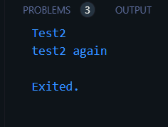
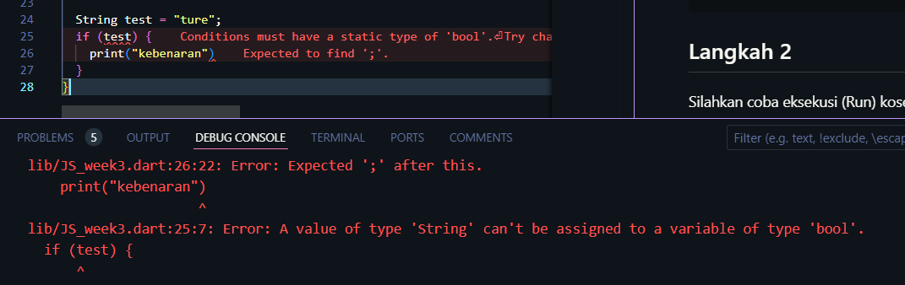
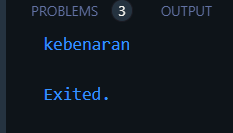
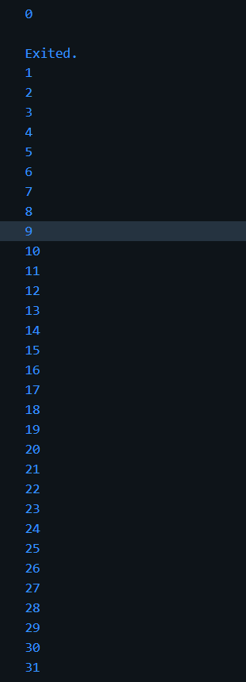
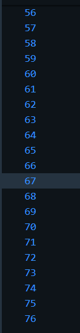
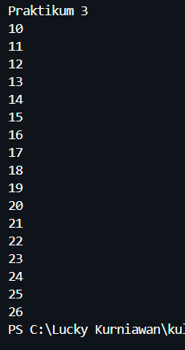
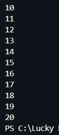
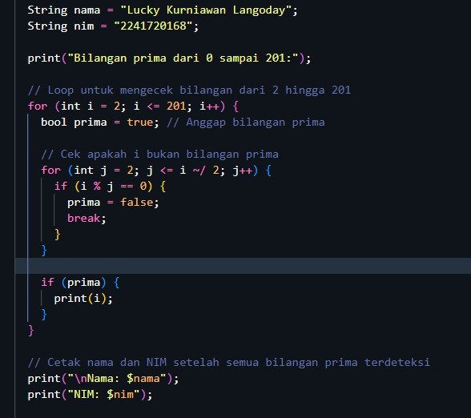
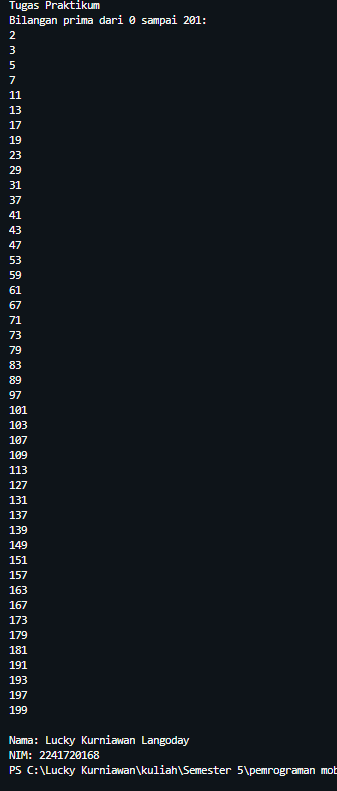

# Praktikum 1 Menerapkan Control Flows ("if/else")

## Langkah 1

ketik atau salin kode program berikut ke dalam fungsi `main()`

```
void main (){
  String  test = "test2";
  if (test == "test1"){
    print("Test1");
  }
  else if (test == "test2"){
    print("Test2");
  }
  else {
    print("Something else");
  }

  if (test == "test2") print("test2 again");
}
```

## Langkah 2

Silahkan coba eksekusi (Run) kose pada langkah 1 tersebut. Apa yang akan terjadi? Jelaskan



Output dari kode program langkah 1 adalah seperti gambar diatas. Hal ini dikarenakan ada variabel bertipe string dengan nama test yang memiliki value test2 dan setelah itu terdapat suatu kondisi if else dimana jika variabel tes bernilai test1 maka sistem akan menampilkan Test 1. Jika variabel test memiliki nilai test2 maka sistem akan menampilkan Test2. tidak hanya itu dibawahnya terdapat kondsi if. jika nilai test memiliki nilai test 2 maka akan menampilkan test2 again

## Langkah 3
Tambahkan kode program berikut, lalu coba esekusi (run) kode anda
```String test = "ture";
  if (test) {
    print("kebenaran")
  }
  ```
Apa yang terjadi? jika terjadi error, silahkan perbaiki namun tetap menggunakan if/else! <br>
maka akan terjadi error hal ini kondisinya kurang jelas. 

Berikut kode untuk memperbaikinya 
 ```String test = "true";
  if (test == "true") {
    print("kebenaran");
  }
  ```
  

# Praktikum 2 Menerapkan Perulangan "while" dan "do-while"
## Langkah 1
Ketik atau salin kode program berikut ke dalam fungsi ```main()```.

```while (counter<33){
    print("counter");
    counter++;
  }
```

## Langkah 2
Silakan coba eksekusi (Run) kode pada langkah 1 tersebut. Apa yang terjadi? Jelaskan! Lalu perbaiki jika terjadi error. <br>
Terjadi error hal ini variabel counter belum di deklarasi . Untuk memperbaikinya variabel counter harus di deklarasi 
```int counter = 0;
  while (counter<33){
    print("$counter");
    counter++;
  }
```



## Langkah 3
Tambahkan kode program berikut, lalu coba eksekusi (Run) kode Anda.
```do {
  print(counter);
  counter++;
} while (counter < 77);
```
tidak terjadi error karena sebelumnya sudah di deklarasi variabel counternya sehingga outputnya akan menampilkan bilangan 0 - 76



# Praktikum 3: Menerapkan Perulangan "for" dan "break-continue"

## Langkah 1
Ketik atau salin kode program berikut ke dalam fungsi ```main()```.
```
for (Index = 10; index < 27; index) {
  print(Index);
}
```
## Langkah 2
Silakan coba eksekusi (Run) kode pada langkah 1 tersebut. Apa yang terjadi? Jelaskan! Lalu perbaiki jika terjadi error. <br>
Terjadi error hal ini disebabkan karena belum di deklarasi variabel index,  penulisan index dalam kode program tidak konsisten (ada yang menggunakan 'index' dan 'Index) dan jangan lupa di increment setiap iterasi/perulangan. berikut kode program setelah dibenarkan



## Langkah 3
Tambahkan kode program berikut di dalam for-loop, lalu coba eksekusi (Run) kode Anda.
```
If (Index == 21) break;
Else If (index > 1 || index < 7) continue;
print(index);
```
Apa yang terjadi ? Jika terjadi error, silakan perbaiki namun tetap menggunakan for dan break-continue.
outputnya tidak ada hal ini dikarenakan kondisi pada else if akan selalu bernilai true dan akan men skip iterasi. agar menghasilkan output maka perlu menggannti operator or '||' menjadi and '&&'
```
for (int index = 10; index < 27; index++) {
    if (index == 21){
      break;
    }  
    else if (index > 1 && index < 7) {
      continue;
    }
    print('$index');
  }
  ```
  

# Tugas Praktikum
Buatlah sebuah program yang dapat menampilkan bilangan prima dari angka 0 sampai 201 menggunakan Dart. Ketika bilangan prima ditemukan, maka tampilkan nama lengkap dan NIM Anda.
## Kode Program
 

## Hasil Output
 

