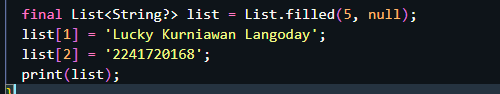

# Pemrograman Mobile Jobsheet 4

## Praktikum 1

### Langkah 1

Ketik dan salin kode program berikut ke dalam `void` `main()`


### Langkah 2

Silakan coba eksekusi (Run) kode pada langkah 1 tersebut. Apa yang terjadi? Jelaskan! <br>

maka akan menghasilkan output 3, 2, 1 dimana 3 diperoleh dari perintah `print(list.length);`, 2 diperolah dari `print(list[1]);` dimana 2 merupakan indeks ke 1 dari var list, dan 1 diperoleh dari `print(list[1]);` setelah nilai dari indeks ke 1 di ubah

### Langkah 3

Ubah kode pada langkah 1 menjadi variabel final yang mempunyai index = 5 dengan default value = null. Isilah nama dan NIM Anda pada elemen index ke-1 dan ke-2. Lalu print dan capture hasilnya.



## Praktikum 2

### Langkah 1

Ketik atau salin kode program berikut ke dalam fungsi `main()`.


### Langkah 2

Silakan coba eksekusi (Run) kode pada langkah 1 tersebut. Apa yang terjadi? Jelaskan! Lalu perbaiki jika terjadi error.

kode program diatas merupakan sebuah varibel bernama halogens yang dideklarasikan sebagai set yang berisi 5 elemen string yaitu fluorine, chlorine, bromine, iodine, dan astatine yang kemudian di cetak

### Langkah 3

Tambahkan kode program berikut, lalu coba eksekusi (Run) kode Anda.
 <br>
Apa yang terjadi ? Jika terjadi error, silakan perbaiki namun tetap menggunakan ketiga variabel tersebut. Tambahkan elemen nama dan NIM Anda pada kedua variabel Set tersebut dengan dua fungsi berbeda yaitu .add() dan .addAll(). Untuk variabel Map dihapus, nanti kita coba di praktikum selanjutnya.
 <br>
ketika dijalankan maka akan menghasilkan output kosong.
 <br>
 <br>

## Praktikum 3

### Langkah 1

Ketik atau salin kode program berikut ke dalam fungsi `main()`.
 <br>

### Langkah 2

Silakan coba eksekusi (Run) kode pada langkah 1 tersebut. Apa yang terjadi? Jelaskan! Lalu perbaiki jika terjadi error.
 <br>
Kode Dart di atas mendeklarasikan dua Map dengan nama gifts dan nobleGases, yang kemudian dicetak ke konsol. Map adalah koleksi pasangan kunci-nilai (key-value pairs) di mana setiap kunci unik dan digunakan untuk mengakses nilai yang sesuai.

### Langkah 3

Tambahkan kode program berikut, lalu coba eksekusi (Run) kode Anda.
Apa yang terjadi ? Jika terjadi error, silakan perbaiki.

 <br>
Tambahkan elemen nama dan NIM Anda pada tiap variabel di atas (gifts, nobleGases, mhs1, dan mhs2). Dokumentasikan hasilnya dan buat laporannya!
 <br>
 <br>
Kode program diatas digunakan untuk membuat map baru yaitu mhs1 dan mhs2

## Praktikum 4

### Langkah 1

Ketik atau salin kode program berikut ke dalam fungsi `main()`.
 <br>

### Langkah 2

Silakan coba eksekusi (Run) kode pada langkah 1 tersebut. Apa yang terjadi? Jelaskan! Lalu perbaiki jika terjadi error. <br>
 <br>
terjadi error hal ini dikarenakan variabel dengan nama `list1` belum didefinisikan, unutuk memperbaikinya saya mengubah dari `list1` menjadi `list`
 <br>
 <br>

### Langkah 3

Tambahkan kode program berikut, lalu coba eksekusi (Run) kode Anda.
 <br>
Apa yang terjadi ? Jika terjadi error, silakan perbaiki.

Tambahkan variabel list berisi NIM Anda menggunakan Spread Operators. Dokumentasikan hasilnya dan buat laporannya! <br>
terjadi error ketika di jalankan
 <br>
untuk mempebaikinya saya mengubah kode program seperti gambar dibawah ini
 <br> dan hasilnya ketika dijalankan
 <br>
gambar dibawah ini merupakan kode program untuk menambahkan variabel list berisi nim dengan menggunakan spread operators <br>
 <br>
 <br>

### Langkah 4

Tambahkan kode program berikut, lalu coba eksekusi (Run) kode Anda.
 <br>
Apa yang terjadi ? Jika terjadi error, silakan perbaiki. Tunjukkan hasilnya jika variabel promoActive ketika true dan false. <br>
 <br>
terjadi error hal ini dikarenakan variabel dengan nama promoActive belum didefinisikan. untuk mengatasi error perlu didefinisikan terlebih dahulu <BR>
`var promoActive = true;`
 <br>
 <br>
`var promoActive = false;`
 <br>
 <br>

variabel `promoActive` digunakan untuk menentukan apakah elemen `'Outlet'` akan dimasukkan ke dalam List `nav`. Penggunaan `if` di dalam list adalah fitur Dart yang disebut conditional elements. Jika `promoActive` bernilai `false`, elemen `'Outlet'` tidak akan dimasukkan ke dalam List `nav`.
Jika `promoActive` bernilai `true`, elemen `'Outlet'` akan ditambahkan ke dalam List `nav`.

### Langkah 5

Tambahkan kode program berikut, lalu coba eksekusi (Run) kode Anda.
 <br>
Apa yang terjadi ? Jika terjadi error, silakan perbaiki. Tunjukkan hasilnya jika variabel login mempunyai kondisi lain.
<br> terjadi error hal ini dikarenakan variabel login belum didefinisikan

jika `login = manager` <br>
 <br>
 <br>
jika `login = pegawai` <br>
 <br>
 <br>

### Langkah 6

Tambahkan kode program berikut, lalu coba eksekusi (Run) kode Anda.
 <br>
Apa yang terjadi ? Jika terjadi error, silakan perbaiki. Jelaskan manfaat Collection For dan dokumentasikan hasilnya <br>
ketika dijalankan maka outputnya <br>
 <br>
**Collection for** pada dart merupakan suatu fitur untuk membuat list baru berdasarkan list yang telah ada. pada langkah 6 penggunaan **Collection for** terlihat pada pemberian elemen untuk variabel `listOfStrings` dimana pada saat iterasi ditambahkan `#` di setiap elemen dari `listOfInts` yang hasilnya berupa `[#0, #1, #2, #3]`

## Praktikum 5

### Langkah 1

Ketik atau salin kode program berikut ke dalam fungsi `main()`.
 <br>

### Langkah 2

Silakan coba eksekusi (Run) kode pada langkah 1 tersebut. Apa yang terjadi? Jelaskan! Lalu perbaiki jika terjadi error.
 <br>

### Langkah 3

Tambahkan kode program berikut di luar scope `void main()`, lalu coba eksekusi (Run) kode Anda.

 <br>

Apa yang terjadi ? Jika terjadi error, silakan perbaiki. Gunakan fungsi `tukar()` di dalam `main()` sehingga tampak jelas proses pertukaran value field di dalam Records.
 <br>
 <br>
kode program tersebut merupakan sebuah method untuk menukar nilai dari variabel record yang awalnya memiliki nilai `(1, 3)` menjadi `(3, 1)`

### Langkah 4

Tambahkan kode program berikut di luar scope `void main()`, lalu coba eksekusi (Run) kode Anda.
 <br>

Apa yang terjadi ? Jika terjadi error, silakan perbaiki. Inisialisasi field nama dan NIM Anda pada variabel record mahasiswa di atas. Dokumentasikan hasilnya dan buat laporannya! <br>
terjadi erro hal ini dikarenakan variabel mahasiswa belum di definisikan
 <br>
 <br>

### Langkah 5

Tambahkan kode program berikut di luar scope `void main()`, lalu coba eksekusi (Run) kode Anda.
 <br>

Apa yang terjadi ? Jika terjadi error, silakan perbaiki. Gantilah salah satu isi record dengan nama dan NIM Anda, lalu dokumentasikan hasilnya dan buat laporannya!
 <br>
untuk mengubah record menjadi nama dan NIM saya
 <br>
 <br>

# Tugas Praktikum

## Jelaskan yang dimaksud Functions dalam bahasa Dart!

Fungsi (Functions) dalam Dart adalah blok kode yang dapat digunakan untuk menjalankan tugas-tugas tertentu secara berulang-ulang.

## Jelaskan jenis-jenis parameter di Functions beserta contoh sintaksnya!

1. Positional Parameters <br>
   a) Parameter Wajib: Parameter yang harus diisi nilainya saat memanggil fungsi. Posisi parameter sangat penting. <br>
   b) Parameter Opsional: Parameter yang boleh diisi atau tidak. Jika tidak diisi, akan menggunakan nilai default jika ada. <br>
    <br>

2. Named Parameters merupakan parameter yang dapat dipanggil dengan menyebutkan namanya secara eksplisit. Urutan parameter tidak penting. <br>
    <br>

## Jelaskan maksud Functions sebagai first-class objects beserta contoh sintaknya!

functions as first-class objects berarti fungsi dapat diperlakukan seperti objek lainnya. Dengan kata lain, functions as first-class objects dapat:

1. Menyimpan fungsi dalam variabel. <br>
   ```
   void greet(String name) {
   print('Hello, $name!');
   }
   void main() {
   var sayHello = greet; // Menyimpan fungsi greet dalam variabel
   sayHello('Lucky'); // Memanggil fungsi greet melalui variabel 
   } 
    ``` 
2. Mengirim fungsi sebagai argumen ke fungsi lain. <br> 
   ```
    void greet(String name) {
        print('Hello, $name!');
    }
    void performGreeting(void Function(String) greetingFunction, String name) {
        greetingFunction(name);
    }
    void main() {
        performGreeting(greet, 'Lucky'); // Mengirim fungsi greet sebagai argumen
    }
    ```
3. Mengembalikan fungsi dari fungsi lain. <br>
    ```
    Function createMultiplier(int factor) {
        return (int value) => value * factor;
    }
    void main() {
        var multiplyByTwo = createMultiplier(2); // Fungsi yang mengalikan dengan 2
        print(multiplyByTwo(5)); // 10
    }
    ```
4. Menyimpan fungsi dalam koleksi seperti list atau map.
    ```
    void add(int a, int b) => print('Sum: ${a + b}');
    void subtract(int a, int b) => print('Difference: ${a - b}');
    
    void main() {
        var operations = [add, subtract]; // Menyimpan fungsi dalam list
        operations[0](3, 4); // Memanggil fungsi add
        operations[1](10, 6); // Memanggil fungsi subtract
    }
    ```
## Apa itu Anonymous Functions? Jelaskan dan berikan contohnya!
Anonymous functions (fungsi anonim) dalam Dart adalah fungsi yang tidak memiliki nama. Fungsi ini biasanya digunakan ketika ingin mendefinisikan fungsi yang hanya digunakan sekali, sehingga tidak perlu membuat nama yang formal untuk fungsi tersebut. Fungsi anonim dapat disimpan dalam variabel, dan dapat digunakan sebagai argumen untuk fungsi lain, serta dalam koleksi seperti list atau map.
```
void main() {
  var greet = (String name) {
    print('Hello, $name!');
  };
  
  greet('Lucky'); // Memanggil fungsi anonim
}
```
## Jelaskan perbedaan Lexical scope dan Lexical closures! Berikan contohnya!
1. Lexical Scope (juga dikenal sebagai static scope) adalah aturan yang menentukan bagaimana variabel diakses berdasarkan posisi mereka dalam kode. Dalam lexical scope, lingkup variabel ditentukan oleh struktur blok kode (seperti fungsi, kelas, atau blok kontrol), dan variabel yang dideklarasikan di dalam blok hanya dapat diakses dalam blok tersebut dan blok turunannya. <br>
```
void main() {
  var x = 10; // Variabel x dideklarasikan di dalam fungsi main

  void innerFunction() {
    var y = 5; // Variabel y dideklarasikan di dalam innerFunction
    print(x); // Akses ke variabel x yang dideklarasikan di lingkup luar
    print(y); // Akses ke variabel y di lingkup saat ini
  }

  innerFunction();

  // print(y); // Ini akan menyebabkan kesalahan karena y tidak dapat diakses di sini
}
```
2. Lexical Closures adalah konsep yang memungkinkan fungsi untuk "membawa" variabel dari lingkup (scope) di mana mereka didefinisikan, bahkan setelah lingkup tersebut selesai dieksekusi. Ini berarti bahwa fungsi dapat mengingat dan mengakses variabel dari lingkup luar, menciptakan semacam "penutupan" terhadap variabel tersebut.
```
Function makeCounter() {
  var count = 0; // Variabel count dideklarasikan di dalam makeCounter

  return () {
    count++; // Fungsi anonim ini "menutup" variabel count
    return count; // Mengembalikan nilai count yang diperbarui
  };
}

void main() {
  var counter = makeCounter(); // Mendapatkan fungsi penutup

  print(counter()); // Output: 1
  print(counter()); // Output: 2
  print(counter()); // Output: 3
}
```
## Jelaskan dengan contoh cara membuat return multiple value di Functions!
untuk membuat return dengan multiple value di functions maka kita bisa menggunakan record
```
(String, int, String) getUserInfo() {
  // Mengembalikan record dengan nama dan usia
  return ('Lucky', 20, 'Gresik');
}

void main() {
  // Memanggil fungsi dan menyimpan hasilnya dalam record
  var userInfo = getUserInfo();

  // Mengakses nilai dari record
  print('Name: ${userInfo.$1}, Age: ${userInfo.$2}, Address: ${userInfo.$3}');
}
```
